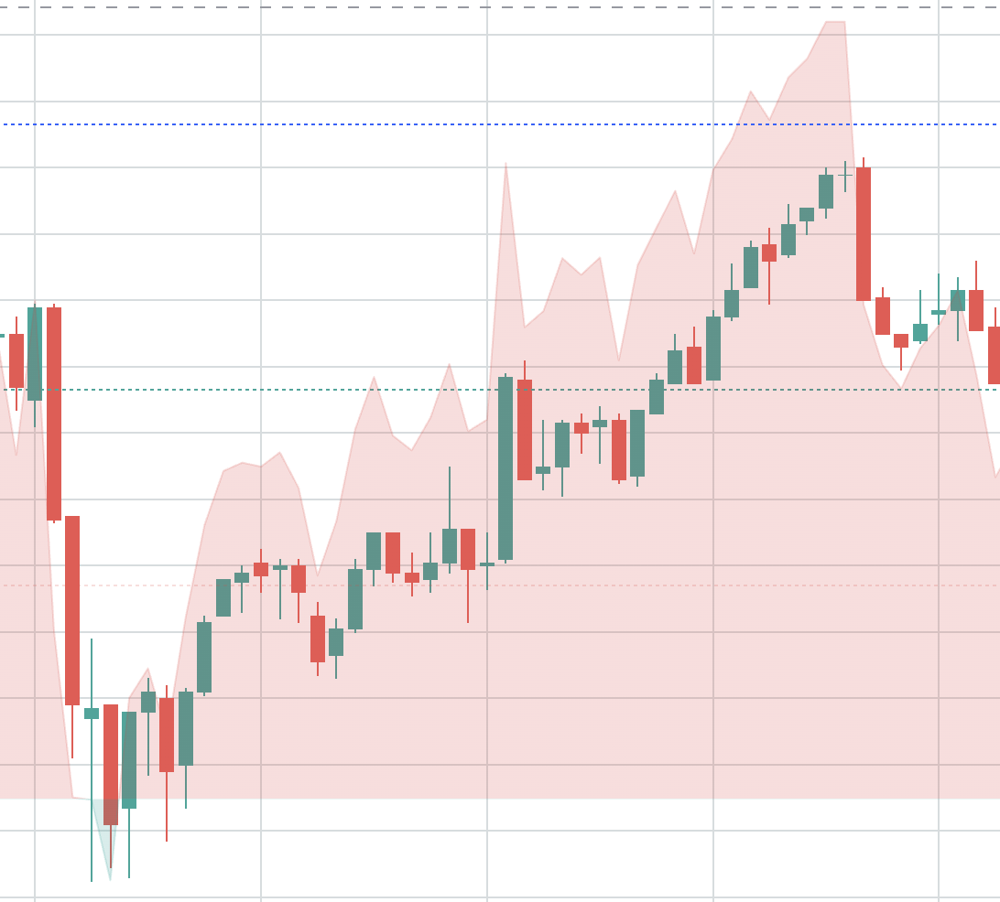

# Spec

Having a set of CSV files in the `dataset` folder with the following structure:

```
time,open,high,low,close,volume,rsi
1609464600000,0.0047319,0.00475,0.0047189,0.00475,8315920.0,63.4633309356425
1609465500000,0.0047467,0.0047639,0.0047199,0.0047365,25398760.0,59.419527863771584
1609466400000,0.0047312,0.0047383,0.0047204,0.0047263,2457619.0,56.49069147000932
```

We should train the model to recognize the climbing pattern



Where the goal of the model is to detect a safest place to predict the up trend.

Generally, if the model is able to recognize better patterns - it will be able to predict the up trend more accurately.

# Structure
There is one file `dataset/DOGEUSDT.csv` as a sample training data. The model should be trained on the whole dataset (the entire folder) if nesseary. There is a list of symbols that are currently commented out.

The dataset includes RSI (I feel like it can be helpful), however, any additional technical indicators can be added if necessary.

To generate more data run `create_dataset.py`


# Training
The model should be saved to the disk

# prediction

Prediction specs are in `predict.py`

* Pull the latest data for a symbol
* Predict the next 10 (if possible) candles and detect if there is an up trend

```python
def predict(dataset):
    # load the model from disk


    # calculate the result
    next10Candles = []
    trendIsUp = False
    return next10Candles, trendIsUp
```